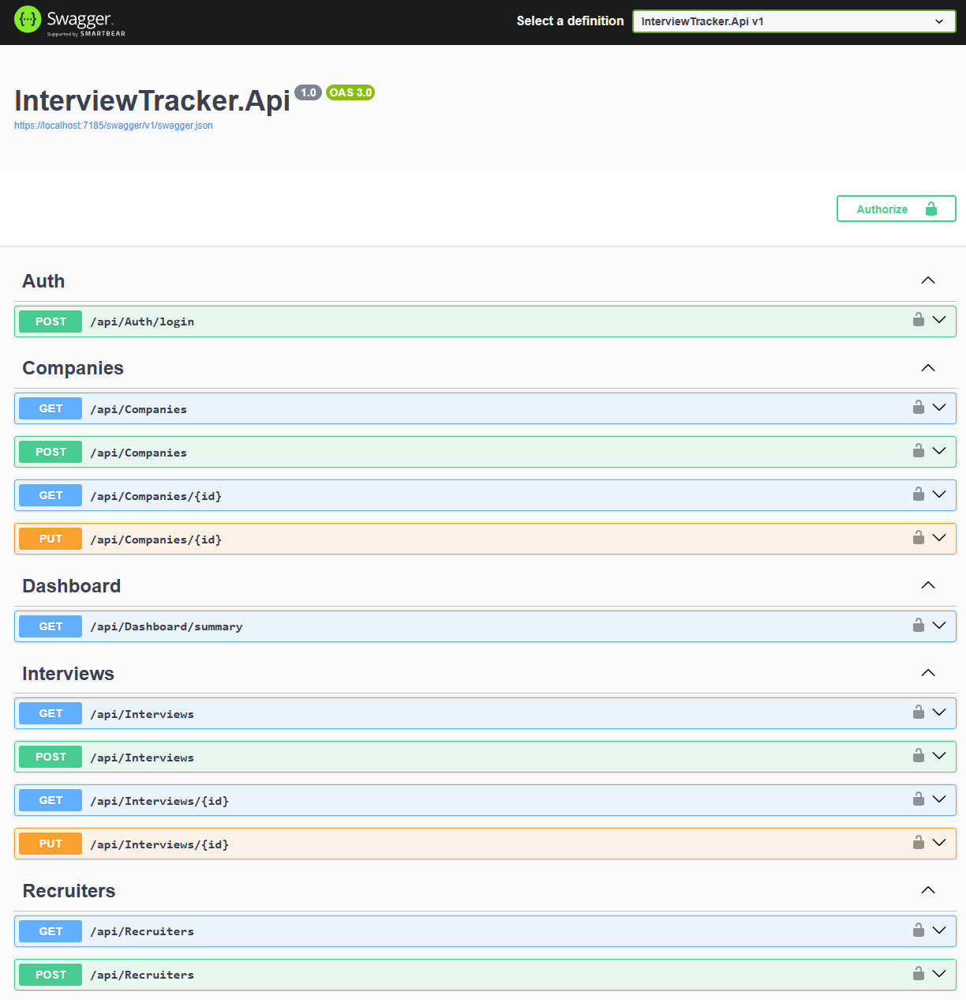

# InterviewTracker

Enterprise-style interview tracking system built with ASP.NET Core .NET 8, Entity Framework Core, SQL Server, Swagger/OpenAPI, layered architecture, stored procedures, and unit testing.

The project is designed to manage companies, recruiters, interviews, interview statuses, salary expectations, and dashboard reporting while following clean separation of concerns across multiple application layers.

## Architecture

```text
InterviewTracker.Api
    Controllers
    Program.cs

InterviewTracker.Business
    Services
    Interfaces
    DTOs

InterviewTracker.Data
    DbContext
    Repositories
    SQL Queries
    Migrations

InterviewTracker.Domain
    Entities / Models

InterviewTracker.Database
    Stored Procedures

InterviewTracker.Tests
    Unit Tests
Tech Stack
ASP.NET Core .NET 8
Entity Framework Core
SQL Server LocalDB
Swagger / OpenAPI
Layered Architecture
Repository Pattern
Dependency Injection
Stored Procedures
xUnit
Moq
EF Core InMemory Provider
Features
Companies Module
Create companies
Retrieve companies
Get company details
Recruiters Module
Create recruiters
Retrieve recruiters
Get recruiter details
Interviews Module
Create interviews
Interview status tracking
Salary expectation tracking
Validation for company and recruiter existence
Dashboard Module
Dashboard summary endpoint
Interview statistics aggregation
Stored procedure integration
Average expected salary calculations
API Endpoints
Companies
Method	Endpoint
GET	/api/Companies
GET	/api/Companies/{id}
POST	/api/Companies
Recruiters
Method	Endpoint
GET	/api/Recruiters
GET	/api/Recruiters/{id}
POST	/api/Recruiters
Interviews
Method	Endpoint
GET	/api/Interviews
GET	/api/Interviews/{id}
POST	/api/Interviews
Dashboard
Method	Endpoint
GET	/api/Dashboard/summary
Example Interview Request
{
  "roleTitle": "Senior .NET Developer",
  "status": "Technical Interview",
  "interviewDate": "2026-05-20T15:00:00",
  "notes": "Technical screening with backend focus.",
  "expectedSalary": 4500,
  "companyId": 1,
  "recruiterId": 1
}
Stored Procedure

The project includes SQL Server stored procedure support for dashboard reporting:

dbo.GetInterviewDashboardSummary

This procedure aggregates:

Total companies
Total recruiters
Total interviews
Interview status counts
Average expected salary
Testing

The solution includes unit tests for:

API Layer
Business Layer
Data Layer

Testing tools:

xUnit
Moq
EF Core InMemory Provider
Future Improvements
JWT Authentication
Role-based authorization
Pagination
Integration tests
Docker support
CI/CD pipeline
React or Vue frontend dashboard
Export reports to Excel/PDF
Email notifications
Interview reminders
Screenshots

Add Swagger and dashboard screenshots here.

Example:

### Swagger Endpoints

Project Goal

The purpose of this project is to demonstrate enterprise backend development practices using modern .NET technologies, layered architecture, repository patterns, testing strategies, SQL Server integrations, and real-world workflow modeling.

## Authentication

The API includes JWT authentication.

Use the login endpoint to generate a token:

| Method | Endpoint |
|---|---|
| POST | `/api/Auth/login` |

Sample request:

```json
{
  "username": "admin",
  "password": "password"
}

## Angular Frontend

The project includes an Angular frontend with:

- JWT login
- Protected routes
- HTTP interceptor
- Dashboard cards
- Interviews table
- Filtering
- Pagination
- Create, update, and delete interview actions
- Status badge colors
